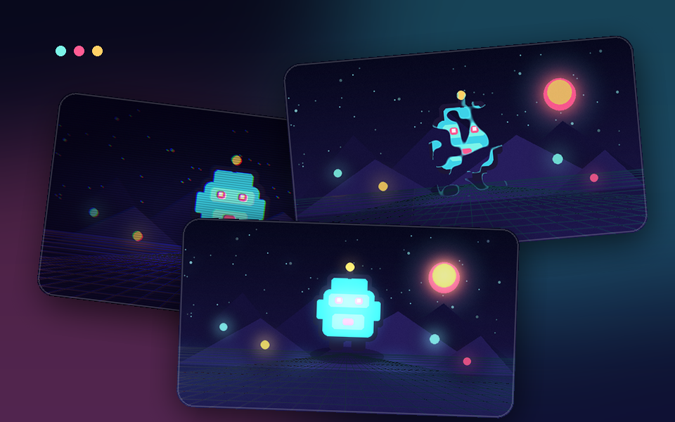

# LÖVE Shader Kit



**LÖVE 11.5向けの、そのまま組み込みやすいシェーダ18種類**を収録したOSSです。各シェーダにプレビュー、最小Lua例、uniformの説明、メタデータ、MITライセンスを付けています。

本プロジェクトは、シェーダフレームワークではなく「レシピ集」に近い構成です。必要なシェーダのフォルダだけを既存ゲームへコピーできます。付属ローダーの利用は任意で、実行時依存はありません。

- 単独利用できる1パスのシェーダ
- スプライト、画面全体、色変換、トランジションの4分類
- `love .` で起動する操作可能なデスクトップギャラリー
- コードをコピーできるGitHub Pages用の静的ギャラリー
- シェーダごとのメタデータ、使用例、README
- LÖVE 11.5で全シェーダをコンパイルするCI

[English README](README.md)

## すぐに使う

使用したいシェーダのフォルダをゲームへコピーし、シェーダを生成してuniformを送信し、対象の描画時だけ有効にします。

```lua
local image
local outline

function love.load()
    image = love.graphics.newImage("player.png")
    outline = love.graphics.newShader("shaders/outline/shader.glsl")
    outline:send("texelSize", {1 / image:getWidth(), 1 / image:getHeight()})
    outline:send("outlineColor", {1.0, 0.82, 0.40, 1.0})
    outline:send("thickness", 1.5)
end

function love.draw()
    love.graphics.setShader(outline)
    love.graphics.draw(image, 100, 100)
    love.graphics.setShader()
end
```

各シェーダフォルダの `usage.lua` に、そのエフェクト専用の最小例があります。画面全体へ適用するエフェクトにはCanvasの準備も含まれます。

## デスクトップギャラリー

[LÖVE 11.5](https://love2d.org/)をインストールし、リポジトリ直下で実行します。

```sh
love .
```

左右キーでシェーダ、上下キーでパラメータを選びます。`A` / `D` またはマウスホイールで値を変更し、`R`で初期化、Spaceでアニメーションを一時停止できます。

## 収録シェーダ

| 分類 | シェーダ |
|---|---|
| スプライト | [Outline](shaders/outline/)、[Hit Flash](shaders/hit-flash/)、[Dissolve](shaders/dissolve/)、[Wave](shaders/wave/)、[Silhouette](shaders/silhouette/)、[Color Replace](shaders/color-replace/) |
| 画面全体 | [Bloom](shaders/bloom/)、[Chromatic Aberration](shaders/chromatic-aberration/)、[CRT](shaders/crt/)、[Directional Blur](shaders/directional-blur/)、[Film Grain](shaders/film-grain/)、[Glitch](shaders/glitch/)、[Pixelate](shaders/pixelate/)、[Scanlines](shaders/scanlines/)、[Vignette](shaders/vignette/) |
| 色変換 | [Grayscale](shaders/grayscale/)、[Posterize](shaders/posterize/) |
| トランジション | [Radial Wipe](shaders/radial-wipe/) |

## 任意のローダー

`love_shader_kit.lua` は生成済みのLuaカタログを読み込み、時間、テクスチャの1ピクセル幅、アスペクト比などのuniformを補助します。

```lua
local kit = require("love_shader_kit")
local shader, spec = kit.load("vignette")

kit.send(shader, spec, {
    intensity = 0.55,
}, {
    source = canvas,
    time = love.timer.getTime(),
})
```

ローダーを使わず、各 `shader.glsl` を直接読み込んでも動作する設計です。

## 構成

```text
shaders/<id>/
  shader.glsl      コピーして使うLÖVEシェーダ
  usage.lua        最小の組み込み例
  metadata.json    カタログ・uniform情報
  preview.png      640×360のプレビュー
  README.md        シェーダ個別ドキュメント

docs/              GitHub Pages用の静的サイト
demo/              LÖVE製の操作可能なギャラリー
scripts/           生成・検証・パッケージ用スクリプト
```

## GitHub Pagesの公開

静的サイトは `docs/` に含まれ、`.github/workflows/pages.yml` がビルドツールなしで公開します。

リポジトリをpushした後、**Settings → Pages** でSourceを **GitHub Actions** に設定し、「Deploy GitHub Pages」ワークフローを実行してください。

## 検証

```sh
python3 scripts/validate.py
python3 scripts/build_catalog.py --check
```

メタデータを変更した後は、以下で生成物を更新します。

```sh
python3 scripts/build_catalog.py
```

プレビュー生成には `requirements-dev.txt` のパッケージが必要です。

```sh
python3 scripts/generate_previews.py
python3 scripts/build_catalog.py
```

ローカルのLÖVEで全シェーダをコンパイルして終了する場合は、以下を実行します。

```sh
LOVE_SHADER_KIT_VALIDATE=1 love .
```

## コントリビューション

[CONTRIBUTING.md](CONTRIBUTING.md)を参照してください。追加するエフェクトは、幅広い2Dゲームで利用でき、コピーしやすく、uniformとライセンスが明確なものを想定しています。

## ライセンス

本リポジトリ内のコードと生成済みプレビュー画像は、将来の個別ファイルに別記がない限り[MIT License](LICENSE)で公開します。
