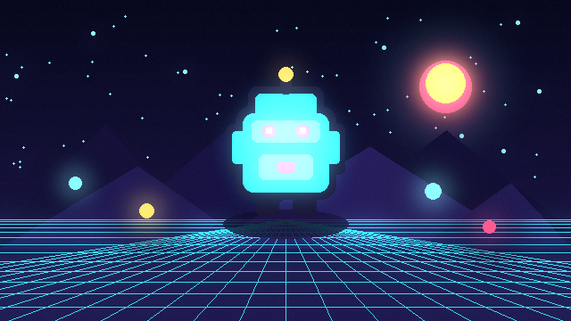
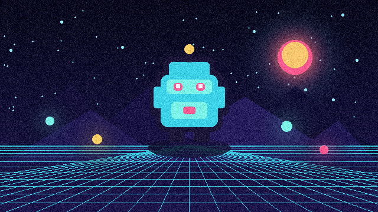
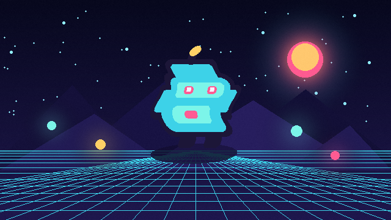

# LÖVE Shader Kit


**18 copy-ready shaders for LÖVE 11.5**, each packaged with a preview, a minimal Lua example, uniform documentation, metadata, and an MIT license.

The project is deliberately closer to a recipe catalog than a framework. You can copy one shader folder into an existing game, or use the small optional loader included in the repository. No runtime dependency is required.

[Live gallery](https://omori0219.github.io/love2d-shader-kit/)

- Standalone, single-pass shader files
- Sprite, screen, color, and transition effects
- Interactive desktop gallery: `love .`
- Searchable GitHub Pages gallery with one-click code copying
- Generated catalog data and per-shader documentation
- CI validation and compilation against the official LÖVE 11.5 AppImage

[日本語版 README](README.ja.md)

## Quick start

Copy a shader folder into your project, create the shader, send its uniforms, and enable it around the draw call.

```lua
local image
local outline

function love.load()
    image = love.graphics.newImage("player.png")
    outline = love.graphics.newShader("shaders/outline/shader.glsl")
    outline:send("texelSize", {1 / image:getWidth(), 1 / image:getHeight()})
    outline:send("outlineColor", {1.0, 0.82, 0.40, 1.0})
    outline:send("thickness", 1.5)
end

function love.draw()
    love.graphics.setShader(outline)
    love.graphics.draw(image, 100, 100)
    love.graphics.setShader()
end
```

Every shader folder contains a tailored `usage.lua` snippet and a README that explains all uniforms. Screen effects include the Canvas setup they need.

## Run the desktop gallery

Install [LÖVE 11.5](https://love2d.org/) and run the repository root:

```sh
love .
```

Use the arrow keys to move through shaders and parameters. Use `A` / `D` or the mouse wheel to adjust the selected value, `R` to reset it, and Space to pause animated effects.

## Shader catalog

| Preview | Shader | Target | Typical use |
|---|---|---|---|
|  | [Bloom](shaders/bloom/) | Screen | Soft glow around bright areas |
|  | [Chromatic Aberration](shaders/chromatic-aberration/) | Screen | Lens split and impact feedback |
|  | [Color Replace](shaders/color-replace/) | Sprite | Team colors and sprite variants |
|  | [CRT](shaders/crt/) | Screen | Curvature, scanlines, and RGB offset |
|  | [Directional Blur](shaders/directional-blur/) | Screen | Motion or axis-aligned blur |
|  | [Dissolve](shaders/dissolve/) | Sprite | Spawn, destroy, and teleport effects |
|  | [Film Grain](shaders/film-grain/) | Screen | Procedural cinematic grain |
|  | [Glitch](shaders/glitch/) | Screen | Digital damage and interruptions |
|  | [Grayscale](shaders/grayscale/) | Screen | Pause states and desaturation |
|  | [Hit Flash](shaders/hit-flash/) | Sprite | Damage and pickup feedback |
|  | [Outline](shaders/outline/) | Sprite | Selection and readable pixel art |
|  | [Pixelate](shaders/pixelate/) | Screen | Retro scaling and transitions |
|  | [Posterize](shaders/posterize/) | Screen | Reduced color levels |
|  | [Radial Wipe](shaders/radial-wipe/) | Screen | Scene reveal transition |
|  | [Scanlines](shaders/scanlines/) | Screen | Retro display treatment |
|  | [Silhouette](shaders/silhouette/) | Sprite | Shadows and hidden entities |
|  | [Vignette](shaders/vignette/) | Screen | Focus and edge darkening |
|  | [Wave](shaders/wave/) | Sprite | Animated sprite distortion |

## Optional loader

`love_shader_kit.lua` reads the generated Lua catalog and handles default and runtime uniforms such as time, texture texel size, and aspect ratio.

```lua
local kit = require("love_shader_kit")
local shader, spec = kit.load("vignette")

kit.send(shader, spec, {
    intensity = 0.55,
}, {
    source = canvas,
    time = love.timer.getTime(),
})
```

The loader is optional. Each `shader.glsl` remains usable by itself.

## Repository layout

```text
shaders/<id>/
  shader.glsl      Copy-ready LÖVE shader
  usage.lua        Minimal integration example
  metadata.json    Catalog and uniform data
  preview.png      640×360 representative preview
  README.md        Effect-specific documentation

docs/              Dependency-free GitHub Pages site
demo/              Interactive LÖVE gallery
scripts/           Catalog, preview, packaging, and validation tools
```

## GitHub Pages

The static site is committed under `docs/`, and `.github/workflows/pages.yml` deploys it without a JavaScript build step.

After pushing the repository, open **Settings → Pages**, choose **GitHub Actions** as the source, and run or re-run the “Deploy GitHub Pages” workflow. Project-page paths are handled automatically by the site.

## Validation and generated files

```sh
python3 scripts/validate.py
python3 scripts/build_catalog.py --check
```

To regenerate catalog files after editing metadata:

```sh
python3 scripts/build_catalog.py
```

Preview generation additionally requires the packages in `requirements-dev.txt`:

```sh
python3 scripts/generate_previews.py
python3 scripts/build_catalog.py
```

To compile every shader with a local LÖVE installation and exit immediately:

```sh
LOVE_SHADER_KIT_VALIDATE=1 love .
```

## Contributing

See [CONTRIBUTING.md](CONTRIBUTING.md). New effects should be broadly useful, documented, easy to copy, and legally safe to redistribute. Ports from Shadertoy or another engine must include compatible licensing and attribution; unattributed code is not accepted.

## License

All code and generated preview assets in this repository are released under the [MIT License](LICENSE), unless a future file explicitly states otherwise.
