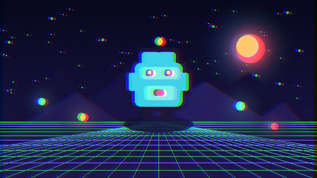

# Chromatic Aberration



Samples the red and blue channels in opposite directions while retaining green from the center. It works as a subtle lens effect or a stronger impact and glitch cue.

- **Category:** `screen`
- **Target:** `screen`
- **Passes:** `1`
- **LÖVE:** `11.5`
- **License:** `MIT`

## Uniforms

| Name | Type | Default | Description |
|---|---|---|---|
| `texelSize` | `vec2` | `[0.0015625, 0.0027778]` | Reciprocal width and height of the source texture. |
| `amount` | `float` | `4.0` | Channel separation in source pixels. |
| `direction` | `vec2` | `[1.0, 0.25]` | Direction of the channel separation. |

## Minimal usage

```lua
-- Draw your scene to a Canvas first.
local canvas = love.graphics.newCanvas()

local function drawScene()
    -- Draw the game world here.
end

local shader = love.graphics.newShader("shaders/chromatic-aberration/shader.glsl")

local function updateShader()
    shader:send("texelSize", {1 / canvas:getWidth(), 1 / canvas:getHeight()})
    shader:send("amount", 4.0)
    shader:send("direction", {1.0, 0.25})
end

function love.draw()
    love.graphics.setCanvas(canvas)
    love.graphics.clear()
    drawScene()
    love.graphics.setCanvas()

    updateShader()
    love.graphics.setShader(shader)
    love.graphics.draw(canvas)
    love.graphics.setShader()
end
```

The shader source is in [`shader.glsl`](shader.glsl).
