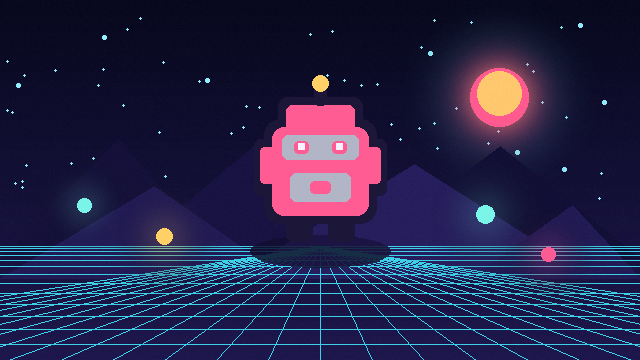

# Color Replace



Measures RGB distance from a target color and blends matching pixels toward a replacement. It is a lightweight option for team colors, skin variants, and palette accents.

- **Category:** `sprite`
- **Target:** `sprite`
- **Passes:** `1`
- **LÖVE:** `11.5`
- **License:** `MIT`

## Uniforms

| Name | Type | Default | Description |
|---|---|---|---|
| `sourceColor` | `vec4` | `[0.2392, 0.8235, 0.9098, 1.0]` | RGBA color to look for. |
| `replacementColor` | `vec4` | `[1.0, 0.35, 0.6, 1.0]` | RGBA replacement color. |
| `tolerance` | `float` | `0.22` | Maximum RGB distance treated as a match. |
| `softness` | `float` | `0.08` | Width of the soft transition around the tolerance. |
| `amount` | `float` | `1.0` | Overall replacement strength. |

## Minimal usage

```lua
-- Assume `image` is a loaded love.graphics.Image.

local shader = love.graphics.newShader("shaders/color-replace/shader.glsl")

local function updateShader()
    shader:send("sourceColor", {0.2392, 0.8235, 0.9098, 1.0})
    shader:send("replacementColor", {1.0, 0.35, 0.6, 1.0})
    shader:send("tolerance", 0.22)
    shader:send("softness", 0.08)
    shader:send("amount", 1.0)
end

function love.draw()
    updateShader()
    love.graphics.setShader(shader)
    love.graphics.draw(image, 100, 100)
    love.graphics.setShader()
end
```

The shader source is in [`shader.glsl`](shader.glsl).
