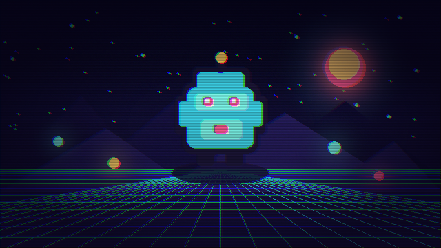

# CRT



A compact single-pass CRT treatment intended for gameplay-sized Canvases. It deliberately favors predictable controls over physically exact display simulation.

- **Category:** `screen`
- **Target:** `screen`
- **Passes:** `1`
- **LÖVE:** `11.5`
- **License:** `MIT`

## Uniforms

| Name | Type | Default | Description |
|---|---|---|---|
| `texelSize` | `vec2` | `[0.0015625, 0.0027778]` | Reciprocal width and height of the source texture. |
| `curvature` | `float` | `0.16` | Strength of barrel distortion. |
| `scanlineStrength` | `float` | `0.18` | Brightness modulation from scanlines. |
| `rgbOffset` | `float` | `1.4` | Horizontal RGB channel offset in source pixels. |
| `vignetteStrength` | `float` | `0.48` | Darkening near the curved edges. |

## Minimal usage

```lua
-- Draw your scene to a Canvas first.
local canvas = love.graphics.newCanvas()

local function drawScene()
    -- Draw the game world here.
end

local shader = love.graphics.newShader("shaders/crt/shader.glsl")

local function updateShader()
    shader:send("texelSize", {1 / canvas:getWidth(), 1 / canvas:getHeight()})
    shader:send("curvature", 0.16)
    shader:send("scanlineStrength", 0.18)
    shader:send("rgbOffset", 1.4)
    shader:send("vignetteStrength", 0.48)
end

function love.draw()
    love.graphics.setCanvas(canvas)
    love.graphics.clear()
    drawScene()
    love.graphics.setCanvas()

    updateShader()
    love.graphics.setShader(shader)
    love.graphics.draw(canvas)
    love.graphics.setShader()
end
```

The shader source is in [`shader.glsl`](shader.glsl).
