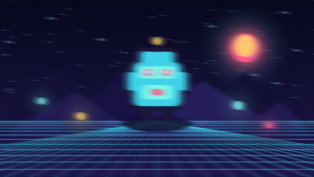

# Directional Blur



Samples the source along a direction vector with Gaussian-like weights. Run it twice with horizontal and vertical directions when a fuller blur is needed.

- **Category:** `screen`
- **Target:** `screen`
- **Passes:** `1`
- **LÖVE:** `11.5`
- **License:** `MIT`

## Uniforms

| Name | Type | Default | Description |
|---|---|---|---|
| `texelSize` | `vec2` | `[0.0015625, 0.0027778]` | Reciprocal width and height of the source texture. |
| `direction` | `vec2` | `[1.0, 0.25]` | Blur direction before normalization. |
| `radius` | `float` | `4.0` | Sampling radius in source pixels. |

## Minimal usage

```lua
-- Draw your scene to a Canvas first.
local canvas = love.graphics.newCanvas()

local function drawScene()
    -- Draw the game world here.
end

local shader = love.graphics.newShader("shaders/directional-blur/shader.glsl")

local function updateShader()
    shader:send("texelSize", {1 / canvas:getWidth(), 1 / canvas:getHeight()})
    shader:send("direction", {1.0, 0.25})
    shader:send("radius", 4.0)
end

function love.draw()
    love.graphics.setCanvas(canvas)
    love.graphics.clear()
    drawScene()
    love.graphics.setCanvas()

    updateShader()
    love.graphics.setShader(shader)
    love.graphics.draw(canvas)
    love.graphics.setShader()
end
```

The shader source is in [`shader.glsl`](shader.glsl).
