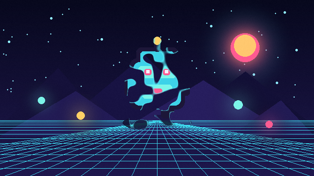

# Dissolve



Uses animated value noise as a threshold mask. A colored edge follows the dissolve boundary, making the effect suitable for spawning, destruction, teleportation, and magical transitions.

- **Category:** `sprite`
- **Target:** `sprite`
- **Passes:** `1`
- **LÖVE:** `11.5`
- **License:** `MIT`

## Uniforms

| Name | Type | Default | Description |
|---|---|---|---|
| `time` | `float` | `0.0` | Animation time in seconds. |
| `progress` | `float` | `0.48` | Dissolve progress: 0 keeps the sprite, 1 removes it. |
| `noiseScale` | `float` | `9.0` | Scale of the procedural noise pattern. |
| `softness` | `float` | `0.035` | Softness of the alpha boundary. |
| `edgeWidth` | `float` | `0.1` | Width of the colored dissolve edge. |
| `edgeColor` | `vec4` | `[0.35, 0.95, 1.0, 1.0]` | RGBA color of the dissolve edge. |

## Minimal usage

```lua
-- Assume `image` is a loaded love.graphics.Image.

local shader = love.graphics.newShader("shaders/dissolve/shader.glsl")

local function updateShader()
    shader:send("time", love.timer.getTime())
    shader:send("progress", 0.48)
    shader:send("noiseScale", 9.0)
    shader:send("softness", 0.035)
    shader:send("edgeWidth", 0.1)
    shader:send("edgeColor", {0.35, 0.95, 1.0, 1.0})
end

function love.draw()
    updateShader()
    love.graphics.setShader(shader)
    love.graphics.draw(image, 100, 100)
    love.graphics.setShader()
end
```

The shader source is in [`shader.glsl`](shader.glsl).
