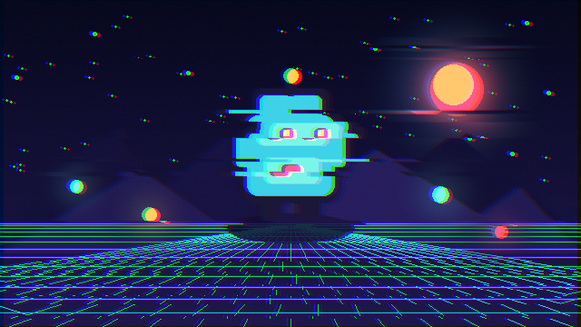

# Glitch



Selects horizontal bands with time-varying noise, shifts those bands, and offsets color channels. It is suitable for UI interruptions, damaged screens, and digital transitions.

- **Category:** `screen`
- **Target:** `screen`
- **Passes:** `1`
- **LÖVE:** `11.5`
- **License:** `MIT`

## Uniforms

| Name | Type | Default | Description |
|---|---|---|---|
| `texelSize` | `vec2` | `[0.0015625, 0.0027778]` | Reciprocal width and height of the source texture. |
| `time` | `float` | `0.0` | Animation time in seconds. |
| `amount` | `float` | `0.42` | Probability and strength of displaced bands. |
| `blockCount` | `float` | `28.0` | Approximate number of horizontal glitch bands. |
| `speed` | `float` | `8.0` | Rate at which the block pattern changes. |
| `rgbOffset` | `float` | `2.0` | Color channel offset in source pixels. |

## Minimal usage

```lua
-- Draw your scene to a Canvas first.
local canvas = love.graphics.newCanvas()

local function drawScene()
    -- Draw the game world here.
end

local shader = love.graphics.newShader("shaders/glitch/shader.glsl")

local function updateShader()
    shader:send("texelSize", {1 / canvas:getWidth(), 1 / canvas:getHeight()})
    shader:send("time", love.timer.getTime())
    shader:send("amount", 0.42)
    shader:send("blockCount", 28.0)
    shader:send("speed", 8.0)
    shader:send("rgbOffset", 2.0)
end

function love.draw()
    love.graphics.setCanvas(canvas)
    love.graphics.clear()
    drawScene()
    love.graphics.setCanvas()

    updateShader()
    love.graphics.setShader(shader)
    love.graphics.draw(canvas)
    love.graphics.setShader()
end
```

The shader source is in [`shader.glsl`](shader.glsl).
