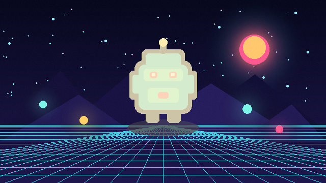

# Hit Flash



Blends opaque pixels toward a configurable flash color while preserving source alpha. This is a compact feedback effect for damage, pickups, and invulnerability frames.

- **Category:** `sprite`
- **Target:** `sprite`
- **Passes:** `1`
- **LÖVE:** `11.5`
- **License:** `MIT`

## Uniforms

| Name | Type | Default | Description |
|---|---|---|---|
| `flashColor` | `vec4` | `[1.0, 0.94, 0.72, 1.0]` | RGBA color used for the flash. |
| `amount` | `float` | `0.78` | Blend amount from the source color to the flash color. |

## Minimal usage

```lua
-- Assume `image` is a loaded love.graphics.Image.

local shader = love.graphics.newShader("shaders/hit-flash/shader.glsl")

local function updateShader()
    shader:send("flashColor", {1.0, 0.94, 0.72, 1.0})
    shader:send("amount", 0.78)
end

function love.draw()
    updateShader()
    love.graphics.setShader(shader)
    love.graphics.draw(image, 100, 100)
    love.graphics.setShader()
end
```

The shader source is in [`shader.glsl`](shader.glsl).
