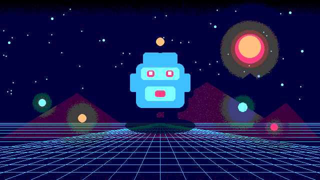

# Posterize



Quantizes RGB channels independently while preserving alpha. It creates a compact retro palette look without requiring a lookup texture.

- **Category:** `color`
- **Target:** `screen`
- **Passes:** `1`
- **LÖVE:** `11.5`
- **License:** `MIT`

## Uniforms

| Name | Type | Default | Description |
|---|---|---|---|
| `levels` | `float` | `5.0` | Number of values retained per RGB channel. |
| `amount` | `float` | `1.0` | Blend amount between the source and posterized color. |

## Minimal usage

```lua
-- Draw your scene to a Canvas first.
local canvas = love.graphics.newCanvas()

local function drawScene()
    -- Draw the game world here.
end

local shader = love.graphics.newShader("shaders/posterize/shader.glsl")

local function updateShader()
    shader:send("levels", 5.0)
    shader:send("amount", 1.0)
end

function love.draw()
    love.graphics.setCanvas(canvas)
    love.graphics.clear()
    drawScene()
    love.graphics.setCanvas()

    updateShader()
    love.graphics.setShader(shader)
    love.graphics.draw(canvas)
    love.graphics.setShader()
end
```

The shader source is in [`shader.glsl`](shader.glsl).
