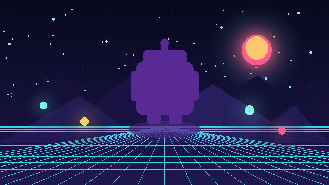

# Silhouette



Replaces RGB values with a single configurable color and leaves the source alpha intact. It works for shadows, hidden enemies, interaction highlights, and monochrome UI icons.

- **Category:** `sprite`
- **Target:** `sprite`
- **Passes:** `1`
- **LÖVE:** `11.5`
- **License:** `MIT`

## Uniforms

| Name | Type | Default | Description |
|---|---|---|---|
| `silhouetteColor` | `vec4` | `[0.15, 0.07, 0.3, 0.88]` | RGBA silhouette color. |
| `amount` | `float` | `1.0` | Blend amount between the source and silhouette. |

## Minimal usage

```lua
-- Assume `image` is a loaded love.graphics.Image.

local shader = love.graphics.newShader("shaders/silhouette/shader.glsl")

local function updateShader()
    shader:send("silhouetteColor", {0.15, 0.07, 0.3, 0.88})
    shader:send("amount", 1.0)
end

function love.draw()
    updateShader()
    love.graphics.setShader(shader)
    love.graphics.draw(image, 100, 100)
    love.graphics.setShader()
end
```

The shader source is in [`shader.glsl`](shader.glsl).
