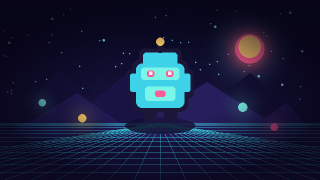

# Vignette



Builds an aspect-correct radial mask around the screen center. Radius, softness, intensity, and tint are adjustable for subtle focus or dramatic tunnel vision.

- **Category:** `screen`
- **Target:** `screen`
- **Passes:** `1`
- **LÖVE:** `11.5`
- **License:** `MIT`

## Uniforms

| Name | Type | Default | Description |
|---|---|---|---|
| `aspect` | `float` | `1.7778` | Source width divided by source height. |
| `radius` | `float` | `0.68` | Distance from center where the vignette begins. |
| `softness` | `float` | `0.38` | Width of the vignette transition. |
| `intensity` | `float` | `0.72` | Blend strength of the vignette color. |
| `vignetteColor` | `vec4` | `[0.0353, 0.0196, 0.0902, 1.0]` | RGBA color applied at the edges. |

## Minimal usage

```lua
-- Draw your scene to a Canvas first.
local canvas = love.graphics.newCanvas()

local function drawScene()
    -- Draw the game world here.
end

local shader = love.graphics.newShader("shaders/vignette/shader.glsl")

local function updateShader()
    shader:send("aspect", canvas:getWidth() / canvas:getHeight())
    shader:send("radius", 0.68)
    shader:send("softness", 0.38)
    shader:send("intensity", 0.72)
    shader:send("vignetteColor", {0.0353, 0.0196, 0.0902, 1.0})
end

function love.draw()
    love.graphics.setCanvas(canvas)
    love.graphics.clear()
    drawScene()
    love.graphics.setCanvas()

    updateShader()
    love.graphics.setShader(shader)
    love.graphics.draw(canvas)
    love.graphics.setShader()
end
```

The shader source is in [`shader.glsl`](shader.glsl).
